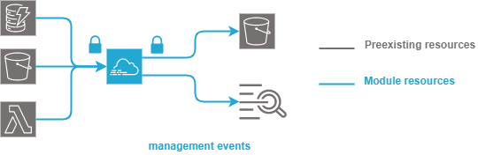

.. image:: docs/imgs/logo.png
   :alt: Logo

===============================
AWS cloudtrail terraform module
===============================

About The Project
=================

This project contains all the infrastructure as code (IaC) to deploy cloudtrail

.. image:: https://badgen.net/github/checks/nadegelemperiere-aws/module-aws-cloudtrail
   :target: https://github.com/nadegelemperiere-aws/module-aws-cloudtrail/actions/workflows/release.yml
   :alt: Status
.. image:: https://img.shields.io/static/v1?label=license&message=MIT&color=informational
   :target: ./LICENSE
   :alt: License
.. image:: https://badgen.net/github/commits/nadegelemperiere-aws/module-aws-cloudtrail/main
   :target: https://github.com/nadegelemperiere-aws/robotframework
   :alt: Commits
.. image:: https://badgen.net/github/last-commit/nadegelemperiere-aws/module-aws-cloudtrail/main
   :target: https://github.com/nadegelemperiere-aws/robotframework
   :alt: Last commit

Built With
----------

.. image:: https://img.shields.io/static/v1?label=terraform&message=1.6.4&color=informational
   :target: https://www.terraform.io/docs/index.html
   :alt: Terraform
.. image:: https://img.shields.io/static/v1?label=terraform%20AWS%20provider&message=5.26.0&color=informational
   :target: https://registry.terraform.io/providers/hashicorp/aws/latest/docs
   :alt: Terraform AWS provider

Getting Started
===============

Prerequisites
-------------

An s3 bucket and a loggroup shall have been created to receive logs.

Configuration
-------------

To use this module in a wider terraform deployment, add the module to a terraform deployment using the following module:

.. code:: terraform

    module "cloudtrail" {
        source            = "https://github.com/nadegelemperiere-aws/module-aws-cloudtrail?ref=<this module version>"
        project           = the project to which the loggroup belongs to be used in naming and tags
        module            = the project module to which the loggroup belongs to be used in naming and tags
        email             = the email of the person responsible for the loggroup maintainance
        environment       = the type of environment to which the loggroup contributes (prod, preprod, staging, sandbox, ...) to be used in naming and tags
        git_version       = the version of the deployment that uses the loggroup to be used as tag
        account           = AWS account to allow loggroup access to root user by default
        service_principal = Technical IAM account used for automation that shall be able to access the loggroup
        bucket            = {
            name       = Id of the S3 bucket to use to collect logs
            prefix     = prefix to use in S3 to write cloudtrail logs
        }
        cloudwatch        = {
            arn        = ARN of the loggroup to collect log
            role       = Role to use to get loggroup access
        }
        events            = [
            {
                type   = type of events to collect ("AWS::S3::Object", "AWS::DynamoDB::Table", ...)
                values = values of events to collect ("arn:aws:s3",...)
            }
        ]
    }

Usage
-----

The module is deployed alongside the module other terraform components, using the classic command lines :

.. code:: bash

    terraform init ...
    terraform plan ...
    terraform apply ...

Detailed design
===============

Module creates a trail and configure it to log the required events. Logs are encrypted using a customer managed key.

Testing
=======

Tested With
-----------

.. image:: https://img.shields.io/static/v1?label=aws_iac_keywords&message=v1.5.0&color=informational
   :target: https://github.com/nadegelemperiere-aws/robotframework
   :alt: AWS iac keywords
.. image:: https://img.shields.io/static/v1?label=python&message=3.12&color=informational
   :target: https://www.python.org
   :alt: Python
.. image:: https://img.shields.io/static/v1?label=robotframework&message=6.1.1&color=informational
   :target: http://robotframework.org/
   :alt: Robotframework
.. image:: https://img.shields.io/static/v1?label=boto3&message=1.29.3&color=informational
   :target: https://boto3.amazonaws.com/v1/documentation/api/latest/index.html
   :alt: Boto3

Environment
-----------

Tests can be executed in an environment :

* in which python and terraform has been installed, by executing the script `scripts/robot.sh`_, or

* in which docker is available, by using the `aws infrastructure image`_ in its latest version, which already contains python and terraform, by executing the script `scripts/test.sh`_

.. _`aws infrastructure image`: https://github.com/nadegelemperiere-docker/terraform-python-awscli
.. _`scripts/robot.sh`: scripts/robot.sh
.. _`scripts/test.sh`: scripts/test.sh

Strategy
--------

The test strategy consists in terraforming test infrastructures based on the cloudtrail module and check that the resulting AWS infrastructure matches what is expected.
The tests currently contains 1 test :

1 - A test to check the capability to create cloudtrail based on the module.

The tests cases :

* Apply terraform to deploy the test infrastructure

* Use specific keywords to model the expected infrastructure in the boto3 format.

* Use shared Cloudwatch keywords based on boto3 to check that the boto3 input matches the expected infrastructure

NB : It is not possible to completely specify the expected infrastructure, since some of the value returned by boto are not known before apply. The comparaison functions checks that all the specified data keys are present in the output, leaving alone the other undefined keys.

Results
-------

The test results for latest release are here_

.. _here: https://nadegelemperiere-aws.github.io/module-aws-cloudtrail/report.html

Issues
======

.. image:: https://img.shields.io/github/issues/nadegelemperiere-aws/module-aws-cloudtrail.svg
   :target: https://github.com/nadegelemperiere-aws/module-aws-cloudtrail/issues
   :alt: Open issues
.. image:: https://img.shields.io/github/issues-closed/nadegelemperiere-aws/module-aws-cloudtrail.svg
   :target: https://github.com/nadegelemperiere-aws/module-aws-cloudtrail/issues
   :alt: Closed issues

Roadmap
=======

N.A.

Contributing
============

.. image:: https://contrib.rocks/image?repo=nadegelemperiere-aws/module-aws-cloudtrail
   :alt: GitHub Contributors Image

We welcome contributions, do not hesitate to contact us if you want to contribute.

License
=======

This code is under MIT License.

Contact
=======

Nadege LEMPERIERE - nadege.lemperiere@gmail.com

Acknowledgments
===============

N.A.
